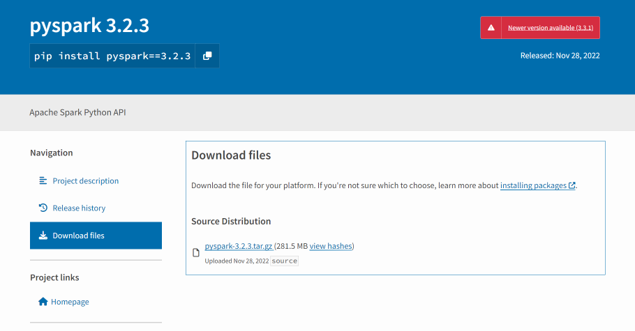
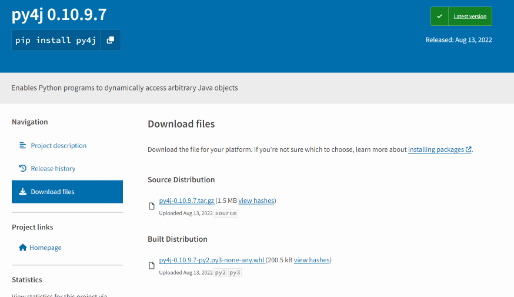
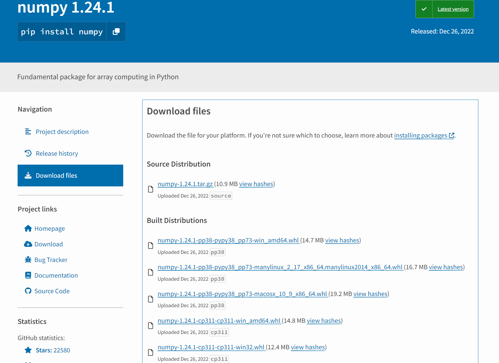

# Install python package offline

Sometimes you need to install a python package on a server. But the server does not have internet connection. You have two solution:
- build your own pypi repo and/or conda private channel
- download the package source with a pc that has internect then copy it to the server, at last do a local install on the local server

## Solution 1: Download the package source and do a local install 

Let's start with something simple, we download the package source and do a local install.

### 1.1 Download the source via web UI

In this tutorial, we will try to install pyspark offline 

Go [PyPI website](https://pypi.org/), and search `pyspark`. Choose the version which you want to install, then click on `Download files` button. You should see below figure:


Download the `.tar.gz` file. 


> Depends on the package, you may see another type of source file such as **.whl**. 

Below figure shows the source file of package `py4j`.


As it shown on the page, the `tar` ball is the source distribution, the `.whl` is the built distribution. For the py4j package, the built distribution works for python2 and 3, and there is no requirement on the `OS` or `CPU architecture`.


#### Handle multiple wheel files

For some package, you may see multiple wheel files. The reason behind this is that `the particular package contains architecture dependent code and/or Python version dependent code`.

For example, below figure shows the wheel file list of the **numpy** package.


The reason is that the `numpy` package contains `C/C++` modules which runs underneath python(That's why numpy has better performance than other python lib on vector and array calculations). As `C/C++` is a compiled language and the compiled byte-code is `OS` and `CPU architecture` dependent. So for each OS (linux, windows, MacOs) and cpu type(Arm, X86, X64, etc.), numpy need to build a distribution.


### 1.2 Download the source via pip

The other way to download the source is to use the **pip** command (recommended way).

Below `pip` command download the pyspark package source to the `./dependencies` folder

```shell
# -d option indicates where to put the downloaded file
pip download pyspark -d "./dependencies"

Collecting pyspark
  Downloading pyspark-3.3.1.tar.gz (281.4 MB)
     |████████████████████████████████| 281.4 MB 107 kB/s 
Collecting py4j==0.10.9.5
  Downloading py4j-0.10.9.5-py2.py3-none-any.whl (199 kB)
     |████████████████████████████████| 199 kB 10.4 MB/s 
Saved ./dependencies/pyspark-3.3.1.tar.gz
Saved ./dependencies/py4j-0.10.9.5-py2.py3-none-any.whl
Successfully downloaded pyspark py4j

# if you have many packages, you can put them into a file, and run below command
pip download -r requirements.txt -d "./dependencies"
```

> You can notice, pip downloaded not only the source of pyspark, but also the dependencies of the  


### 1.3 Install the source

#### 1.3.1 Install the tar ball

It's quite easy to install a tarbar. See below example

```shell
# general form
# -f or --find-links means If a local path or url (file://...) is a directory, then look for archives in the directory listing
# --no-index means Ignore package index (only looking at --find-links URLs instead).
pip install --find-links ./ --no-index <path-of-the-tar.gz>

# if you have the exact path of the tar ball, just run
pip install <path-of-the-tar.gz>

# example
pip install pyspark-3.3.1.tar.gz

# output
Processing ./pyspark-3.3.1.tar.gz
Collecting py4j==0.10.9.5
  Using cached py4j-0.10.9.5-py2.py3-none-any.whl (199 kB)
Building wheels for collected packages: pyspark
  Building wheel for pyspark (setup.py) ... done
  Created wheel for pyspark: filename=pyspark-3.3.1-py2.py3-none-any.whl size=281845513 sha256=6d874ca15ca5714fd1744dbaa065280b3e84b0bf12890cd2f4b9ac21866501c0
  Stored in directory: /home/coder/.cache/pip/wheels/56/7d/48/c289a6da1f8080870ea79bdc9b03864a3f0477da6a962bb9da
Successfully built pyspark
Installing collected packages: py4j, pyspark
Successfully installed py4j-0.10.9.5 pyspark-3.3.1
```

#### 1.3.2 Install the wheel file

```shell
# same as tar ball, just replace the path to tarbar by .whl
pip install --no-index -f ./ numpy-1.24.1-cp310-cp310-manylinux_2_17_x86_64.manylinux2014_x86_64.whl

# output
Looking in links: ./
Processing ./numpy-1.24.1-cp310-cp310-manylinux_2_17_x86_64.manylinux2014_x86_64.whl
Installing collected packages: numpy
  Attempting uninstall: numpy
    Found existing installation: numpy 1.22.4
    Uninstalling numpy-1.22.4:
      Successfully uninstalled numpy-1.22.4
Successfully installed numpy-1.24.1
```

> You can notice pip scans the `./` as we asked with `-f ./`


## Solution 2: Private Pypi repo server

Possible candidte:
- pypi-server: https://github.com/mosquito/pypi-server/blob/master/README.rst 
- mypypi: https://pypi.org/project/mypypi/
- devpi: https://github.com/devpi/devpi
- warehouse: https://pypi.org/project/warehouse14/


tuto for pypi-server: 

1. https://testdriven.io/blog/private-pypi/
2. https://medium.com/geekculture/setting-a-private-pypi-server-with-nginx-acbb73c8516d